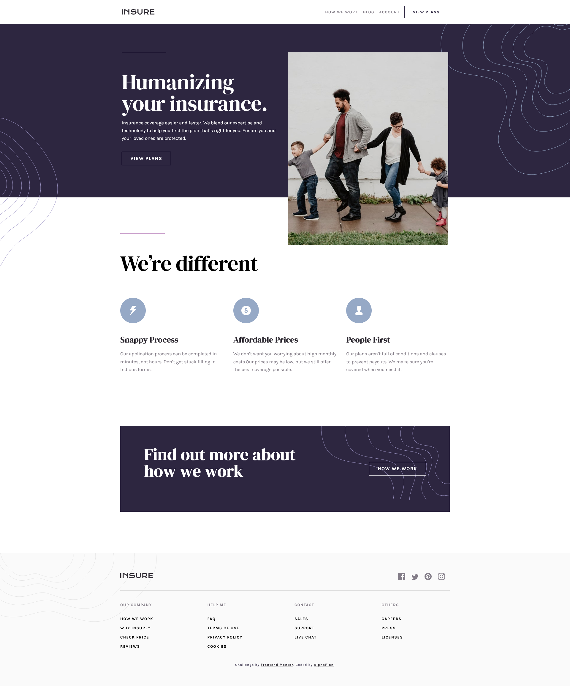

# Frontend Mentor - Insure landing page solution

This is a solution to the [Insure landing page challenge on Frontend Mentor](https://www.frontendmentor.io/challenges/insure-landing-page-uTU68JV8). Frontend Mentor challenges help you improve your coding skills by building realistic projects.

## Table of contents

- [Overview](#overview)
  - [The challenge](#the-challenge)
  - [Screenshot](#screenshot)
  - [Links](#links)
- [My process](#my-process)
  - [Built with](#built-with)
  - [What I learned](#what-i-learned)
  - [Continued development](#continued-development)
  - [Useful resources](#useful-resources)
- [Author](#author)
- [Acknowledgments](#acknowledgments)

**Note: Delete this note and update the table of contents based on what sections you keep.**

## Overview

### The challenge

Users should be able to:

- View the optimal layout for the site depending on their device's screen size
- See hover states for all interactive elements on the page
- view the interactivity for the navbar when in a different screen size

### Screenshot



### Links

- Solution URL: [My solution]([https://your-solution-url.com](https://github.com/AlphaFian/Insure-landing-page.git))
- Live Site URL: [Live site](https://insure-landing-page-tau-cyan.vercel.app/)

## My process

### Built with

- Semantic HTML5 markup
- CSS custom properties
- Flexbox
- CSS Grid
- Mobile-first workflow

### What I learned

CSS

```css
/* for styling the content width for mobile and adjust the max-width for desktop to 1110px */
.main-header {
  display: grid;
  grid-template-columns: 1fr min(1100px, 90%) 1fr;
}
/* making the content in the middle of the page */
.header-content {
  grid-column: 2;
}

/* for reset the desktop navbar */
.navigation-links {
  display: flex;
  position: static;
  align-items: center;
  top: auto;
  left: auto;
  width: auto;
  height: auto;
  background: none;
  padding: 0;
  gap: 16px;
  flex-direction: row;
  font-size: 0.8125rem;
  line-height: 1.15;
  letter-spacing: 1.5px;
}
```

### Continued development

for next improvement, i think this project need to be added some transition for the mobile and tablet navbar.

### Useful resources

- [Fluid Typography Calculator](https://royalfig.github.io/fluid-typography-calculator/) - This helped me setting the responsive fonts
- [ChatGPT](https://chatgpt.com) - This AI Help to solve my problem when coding.
- [Vercel](https://vercel.com) - this website help me to deploy my project for free

## Author

- Website - [Alfian](https://fanciful-valkyrie-25e8c7.netlify.app/)
- Frontend Mentor - [@AlphaFian](https://www.frontendmentor.io/profile/AlphaFian)
- LinkedIn - [@alfian](https://www.linkedin.com/in/ardan-alfian-528a761b6/)

## Acknowledgments

Thank you for frontend Mentor that has many website project design. so i can learn to practice my coding skill.
